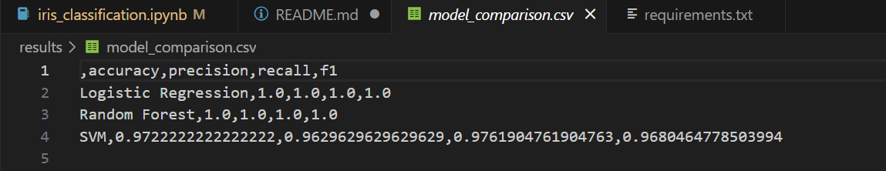
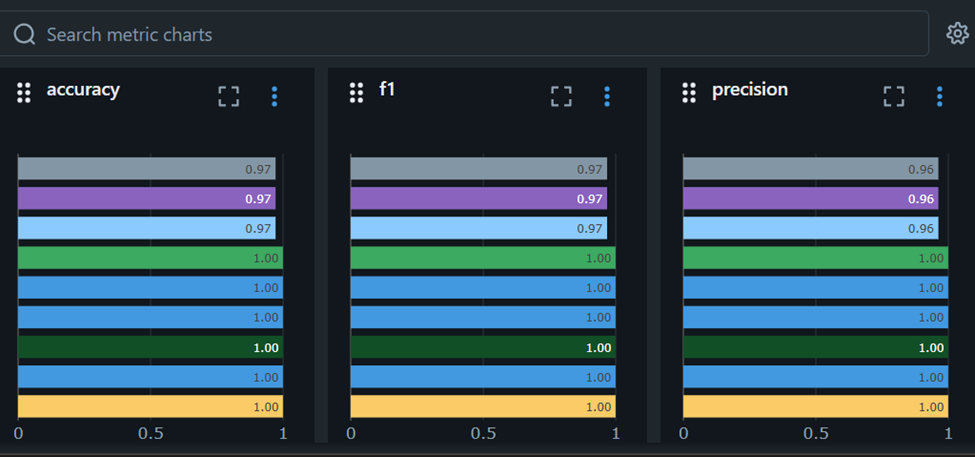
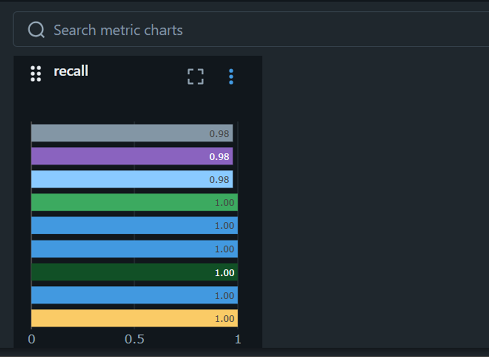

# 🚀 MLOps Assignment 1 – GitHub Basics & MLflow Tracking

> **Repository:** `imrazi04/mlops-assignment-1`  
> This README documents every step to reproduce, run, inspect, and extend the project (data → models → MLflow → registered model).  

---

## 📖 Project Overview
This repository was developed as part of **MLOps Assignment 1**, focusing on implementing an end-to-end workflow.  
The main objectives were to:

- Practice **version control workflows** using GitHub  
- Build and compare **multiple machine learning models**  
- Track experiments with **MLflow**  
- Register and monitor the **best-performing model**  

👉 The emphasis was placed on **reproducibility**, **collaboration**, and **structured experiment tracking**.

---

## 📂 Repository Structure
```bash
mlops-assignment-1/
├── data/            # datasets (if any external data is added later)
├── notebooks/       # Jupyter notebooks for experiments
├── src/             # source code files (future modularization)
├── models/          # saved trained models
├── results/         # logs, screenshots, evaluation outputs
├── mlruns/          # MLflow experiment tracking logs
├── mlartifacts/     # MLflow artifacts
├── requirements.txt # dependencies
├── LICENSE          # license file
└── README.md        # project documentation
🧰 Requirements
Python 3.8+

Git

Virtual environment (recommended)

Install dependencies
bash
Copy code
pip install -r requirements.txt
Example requirements.txt includes:

Copy code
scikit-learn
pandas
numpy
matplotlib
joblib
mlflow
jupyter
🔁 Setup & Usage
1. Clone the repository
bash
Copy code
git clone https://github.com/imrazi04/mlops-assignment-1.git
cd mlops-assignment-1
2. Create & activate virtual environment
bash
Copy code
python -m venv .venv
# Linux/Mac
source .venv/bin/activate
# Windows PowerShell
.venv\Scripts\Activate.ps1
3. Install dependencies
bash
Copy code
pip install -r requirements.txt
4. Start MLflow server
bash
Copy code
mlflow ui
👉 Open MLflow UI at: http://127.0.0.1:5000

5. Run training notebook
bash
Copy code
jupyter notebook notebooks/train_models.ipynb
📊 Dataset
Iris Dataset from scikit-learn.

3 classes of flowers: Setosa, Versicolor, Virginica.

4 numerical features: sepal length, sepal width, petal length, petal width.

Example loading code
python
Copy code
from sklearn.datasets import load_iris
from sklearn.model_selection import train_test_split

iris = load_iris()
X, y = iris.data, iris.target
X_train, X_test, y_train, y_test = train_test_split(
    X, y, test_size=0.2, random_state=42
)
🔬 Data Preprocessing
Standard scaling applied for Logistic Regression and SVM.

python
Copy code
from sklearn.preprocessing import StandardScaler
scaler = StandardScaler()
X_train = scaler.fit_transform(X_train)
X_test = scaler.transform(X_test)
✅ Training & Evaluation Function
Reusable helper function:

python
Copy code
from sklearn.metrics import accuracy_score, precision_score, recall_score, f1_score, confusion_matrix, ConfusionMatrixDisplay
import joblib, matplotlib.pyplot as plt, os

def train_evaluate_save(model, model_name):
    model.fit(X_train, y_train)
    y_pred = model.predict(X_test)

    metrics = {
        'accuracy': accuracy_score(y_test, y_pred),
        'precision': precision_score(y_test, y_pred, average='macro'),
        'recall': recall_score(y_test, y_pred, average='macro'),
        'f1': f1_score(y_test, y_pred, average='macro')
    }

    os.makedirs('models', exist_ok=True)
    joblib.dump(model, f'models/{model_name}.pkl')

    os.makedirs('results', exist_ok=True)
    cm = confusion_matrix(y_test, y_pred)
    disp = ConfusionMatrixDisplay(confusion_matrix=cm, display_labels=iris.target_names)
    disp.plot()
    plt.savefig(f'results/{model_name}_confusion_matrix.png')
    plt.close()

    return metrics
🤖 Models Trained
Logistic Regression
python
Copy code
from sklearn.linear_model import LogisticRegression
lr = LogisticRegression(max_iter=1000)
lr_metrics = train_evaluate_save(lr, 'logistic_regression')
Random Forest
python
Copy code
from sklearn.ensemble import RandomForestClassifier
rf = RandomForestClassifier(n_estimators=100, random_state=42)
rf_metrics = train_evaluate_save(rf, 'random_forest')
Support Vector Machine (SVM)
python
Copy code
from sklearn.svm import SVC
svm = SVC(kernel='linear', random_state=42)
svm_metrics = train_evaluate_save(svm, 'svm')
Save Metrics Comparison
python
Copy code
import pandas as pd
metrics_df = pd.DataFrame(
    [lr_metrics, rf_metrics, svm_metrics],
    index=['Logistic Regression', 'Random Forest', 'SVM']
)
metrics_df.to_csv('results/model_comparison.csv')
✅ Outcome: Best-performing model depends on dataset split; Logistic Regression and SVM usually perform very well on Iris.



📈 MLflow Tracking
Setup
bash
Copy code
pip install mlflow
mlflow ui
Experiment Logging
python
Copy code
import mlflow, mlflow.sklearn
mlflow.set_tracking_uri("http://localhost:5000")
mlflow.set_experiment("Iris_Classification")
Logging Wrapper
python
Copy code
def train_log_mlflow(model, model_name, params, experiment_name="Iris_Classification"):
    mlflow.set_experiment(experiment_name)
    with mlflow.start_run(run_name=model_name):
        mlflow.log_params(params)
        metrics = train_evaluate_save(model, model_name)
        for metric, value in metrics.items():
            mlflow.log_metric(metric, value)
        mlflow.log_artifact(f'results/{model_name}_confusion_matrix.png')
        mlflow.sklearn.log_model(model, "model")
        return mlflow.active_run().info.run_id
Example Runs
python
Copy code
# Logistic Regression
lr_params = {'max_iter': 1000, 'C': 1.0}
lr_run_id = train_log_mlflow(LogisticRegression(**lr_params), 'lr_run', lr_params)

# Random Forest
rf_params = {'n_estimators': 100, 'random_state': 42}
rf_run_id = train_log_mlflow(RandomForestClassifier(**rf_params), 'rf_run', rf_params)

# SVM
svm_params = {'kernel': 'linear', 'C': 1.0, 'random_state': 42}
svm_run_id = train_log_mlflow(SVC(**svm_params), 'svm_run', svm_params)
🏷 Model Registration
Register the best model (e.g., Logistic Regression):

python
Copy code
run_id = lr_run_id
mlflow.register_model(f"runs:/{run_id}/model", "IrisClassifier")
🔎 Results & Artifacts
results/model_comparison.csv → performance metrics table

results/*_confusion_matrix.png → confusion matrices

models/*.pkl → serialized trained models

mlruns/ → MLflow experiment logs

Best model: depends on experiment run (often Logistic Regression or SVM) registered as IrisClassifier v1

🛠 Troubleshooting
ModuleNotFoundError: No module named 'sklearn'
bash
Copy code
pip install scikit-learn
jupyter: command not found
bash
Copy code
pip install jupyter
MLflow UI not showing
bash
Copy code
mlflow ui --port 5001
(then open http://127.0.0.1:5001)

📚 Key Learnings
GitHub & Version Control: branching, merging, pull requests.

ML Models: trained Logistic Regression, Random Forest, and SVM.

MLflow: tracked experiments, logged metrics & artifacts.


Model Registry: best model registered for reproducibility.

🏆 Final Outcomes
✅ Multiple ML models trained and compared
✅ Parameters, metrics, and artifacts logged in MLflow
✅ Best model registered in MLflow Registry
✅ Code and experiments fully version-controlled in GitHub

📜 License
MIT License